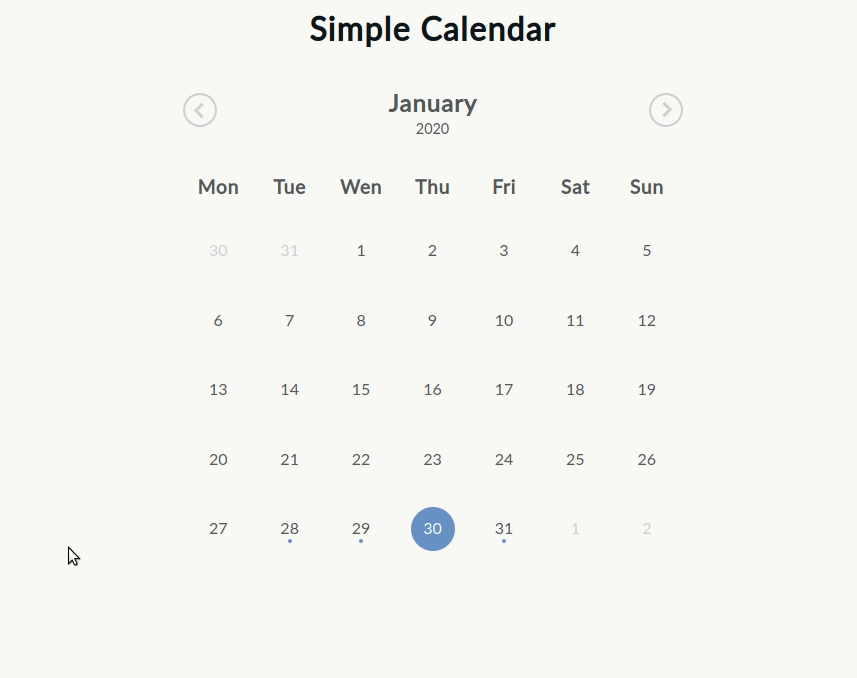

# Simple Calendar


A simple and easy plugin to create a calendar and add events to it.

## Usage

### Including files

You need to include :
- A recent version of [JQuery](https://jquery.com/)
- The javascript file ``jquery.simple-calendar.js``
- The stylesheet ``simple-calendar.css``

```html
<script src="http://ajax.googleapis.com/ajax/libs/jquery/1.11.1/jquery.min.js"></script>
<script type="text/javascript" src="jquery.simple-calendar.js"></script>
<link rel="stylesheet" type="text/css" href="simple-calendar.css" />
```

### Simple usage
Inside a ``$(document).ready();`` function you need to call the plugin on a container jquery element :
```javascript
$(document).ready(function(){
    $("#container").simpleCalendar();
});
```

This initialize the calendar with its default settings.

### Usage with options

To customize its settings simply overwrite them like below :

```javascript
$(document).ready(function(){
    $("#container").simpleCalendar({
        //Defaults options below
        //string of months starting from january
        months: ['january','february','march','april','may','june','july','august','september','october','november','december'],
        days: ['sunday','monday','tuesday','wednesday','thursday','friday','saturday'],
        displayYear: true,              // Display year in header
        fixedStartDay: true,            // Week begin always by monday or by day set by number 0 = sunday, 7 = saturday, false = month always begin by first day of the month
        displayEvent: true,             // Display existing event
        disableEventDetails: false, // disable showing event details
        disableEmptyDetails: false, // disable showing empty date details
        events: [],                     // List of events
        onInit: function (calendar) {}, // Callback after first initialization
        onMonthChange: function (month, year) {}, // Callback on month change
        onDateSelect: function (date, events) {}, // Callback on date selection
        onEventSelect: function() {}, // Callback on event selection - use $(this).data('event') to access the event
        onEventCreate: function( $el ) {},          // Callback fired when an HTML event is created - see $(this).data('event')
        onDayCreate:   function( $el, d, m, y ) {}  // Callback fired when an HTML day is created   - see $(this).data('today'), .data('todayEvents')
    });
});
```

#### Calendar events

Events are json object that contains `startDate`, `endDate`, and `summary`
```javascript
var events = [{
    startDate: Date|timestamp|ISOstring,
    endDate: Date|timestamp|ISOstring,
    summary: string
}]
```

### Methods

To use methods, first get the plugin instance from the data properties and then use the following methods.
```javascript
var container = $("#container").simpleCalendar({ ...code });
let $calendar = container.data('plugin_simpleCalendar')
```

#### Add event
```javascript
var newEvent = {
  startDate: new Date(new Date().setHours(new Date().getHours() + 48)).toISOString(),
  endDate: new Date(new Date().setHours(new Date().getHours() + 49)).getTime(),
  summary: 'New event'
}

$calendar.addEvent(newEvent)
```

#### Set events
```javascript
var events = [{
  startDate: new Date(new Date().setHours(new Date().getHours() + 48)).toISOString(),
  endDate: new Date(new Date().setHours(new Date().getHours() + 49)).getTime(),
  summary: 'New event'
},
{
  startDate: new Date(new Date().setHours(new Date().getHours() - 24)).toISOString(),
  endDate: new Date(new Date().setHours(new Date().getHours() - 23)).getTime(),
  summary: 'New event 2'
}]

$calendar.setEvents(events)
```
